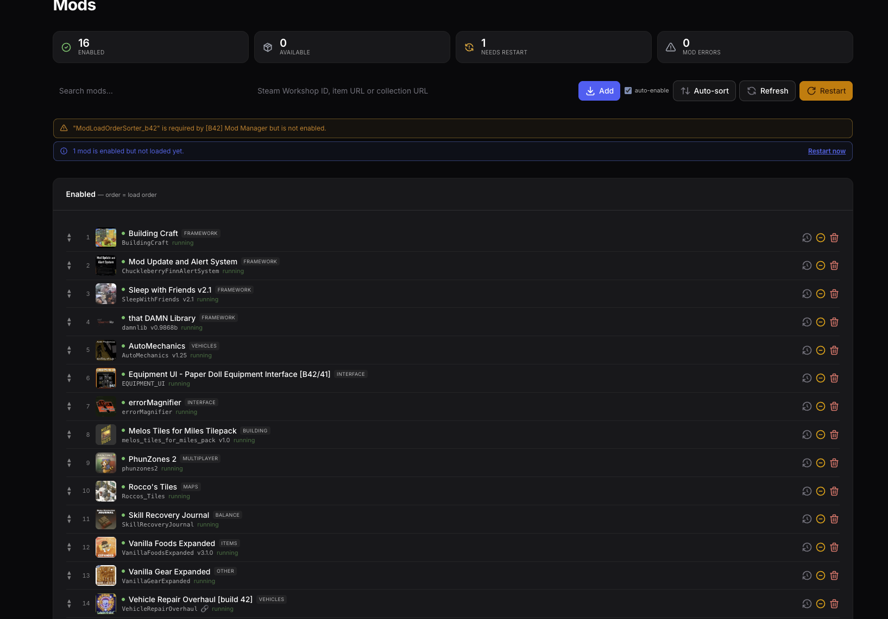

# Project Zomboid Mod Manager

A [Pelican Panel](https://pelican.dev) plugin that turns the two cryptic lines in
a Project Zomboid server config (`WorkshopItems=` and `Mods=`) into a mod manager
your whole team can use.

It adds a **Mods** page to the server panel. The page is visible to anyone with
file access to the server — not just admins — and only appears for Project
Zomboid servers.



## Why

Managing Project Zomboid mods by hand is error-prone:

- `WorkshopItems=` decides what gets **downloaded**, `Mods=` decides what gets
  **loaded**, and the two silently drift apart. A mod missing from
  `WorkshopItems=` is never downloaded by connecting clients.
- The internal mod id you need for `Mods=` only exists inside `mod.info` *after*
  the mod has been downloaded.
- Build 42 mods ship several versions in one folder (`common/`, `42.14/`), and
  one Workshop item can contain several separate mods.
- A mod with an unmet dependency is silently skipped by the server.

This plugin handles all of that and shows you what the server is *actually*
doing.

## Features

**Adding mods**
- Paste a Workshop ID, an item URL, or a **whole collection URL** — collections
  expand to every item they contain.
- Optional *auto-enable*: the plugin reads the mod id advertised on Steam so a
  single restart is often enough. The guess is verified against the real
  `mod.info` after download and corrected automatically if it was wrong.

**Honest status**
The plugin reads the server log to see which mods the running server actually
loaded, so every mod reports the truth:

| Status | Meaning |
| --- | --- |
| running | enabled and loaded by the server |
| restart to apply | enabled, on disk, not loaded yet |
| downloads on restart | enabled, not downloaded yet |
| server could not load it | the server tried and refused — usually a missing dependency |
| not found | listed in `Mods=` but nowhere on the server |

**Load order**
- Move mods up and down; the order in the list is the load order.
- **Auto-sort** performs a topological sort on the `require=` dependencies in
  each `mod.info`, with frameworks first.
- Warns when the load order has changed but has not been applied yet.

**Keeping the config correct**
- Workshop IDs missing from `WorkshopItems=` are restored automatically.
- Duplicate entries are removed.
- Disabling a mod also removes its Workshop ID, so clients stop downloading it,
  while the files stay on the server for a quick re-enable.
- Deleting a mod removes it from the config *and* deletes its files.

**Problem detection** — each with a one-click fix where one exists:
missing dependencies, mods that failed to load, build mismatches, mods that
threw errors during the last boot, map mods absent from `Map=`, fatal
world-loading crashes, and pending downloads.

**Nice to have**
- Titles, categories and thumbnails from Steam.
- Installed version, install date, and an *update available* badge when Steam has
  a newer build than the files on disk.
- Workshop changelog viewer.
- Restart the server from the page (respects the `control.restart` permission).
- English and Dutch, through standard Laravel language files.

## Requirements

- Pelican Panel (tested on `1.0.0-beta35`)
- A Project Zomboid egg (the page only appears for eggs whose name contains
  "zomboid")
- Outbound HTTPS from the panel container for Steam metadata — the plugin works
  without it, just without titles, categories and thumbnails

## Installation

**Via the panel** — download the release zip and use the Import button on the
plugin list.

**Manually** — place the plugin in your panel's `plugins` directory. The folder
name must match the plugin id:

```bash
cd /var/www/pelican/plugins        # or /opt/pelican/plugins for the Docker setup
git clone https://github.com/WildBrianNL/pz-mod-manager.git
php artisan p:plugin:install pz-mod-manager
php artisan optimize:clear
```

For the official Docker Compose setup the panel runs in a container, so run the
artisan commands inside it:

```bash
docker exec pelican-panel-1 php artisan p:plugin:install pz-mod-manager
docker exec pelican-panel-1 php artisan optimize:clear
```

## Permissions

| Action | Required subuser permission |
| --- | --- |
| View the page | `file.read` |
| Add, enable, disable, delete, reorder | `file.update` |
| Restart button | `control.restart` |

## How it works

The server `.ini` is the single source of truth — the plugin keeps no mod list of
its own and re-reads the config before every change, so two people editing at the
same time cannot clobber each other's work. It refuses to write whenever the
config could not be read first.

Installed mods are discovered through a single Wings search for `mod.info`, which
handles every Build 42 layout. Parsed results are cached against a fingerprint of
the files on disk, so a finished download appears immediately while repeat visits
stay fast.

## Configuration

`config/pz-mod-manager.php` holds the Steam app id, the fallback build (the
running server's build is detected automatically), the egg name to match, and
cache lifetimes. The defaults are fine for a normal Project Zomboid server.

## Building a release zip

The folder inside the zip must be named `pz-mod-manager`:

```bash
zip -r pz-mod-manager.zip pz-mod-manager -x '*.git*'
```

## Contributing

Issues and pull requests are welcome. Please keep changes focused.

## Credits

Built by [WildBrianNL](https://github.com/WildBrianNL) for a public Project
Zomboid server, with substantial help from Claude (Anthropic). Not affiliated
with The Indie Stone or Valve.

## License

MIT — see [LICENSE](LICENSE).
