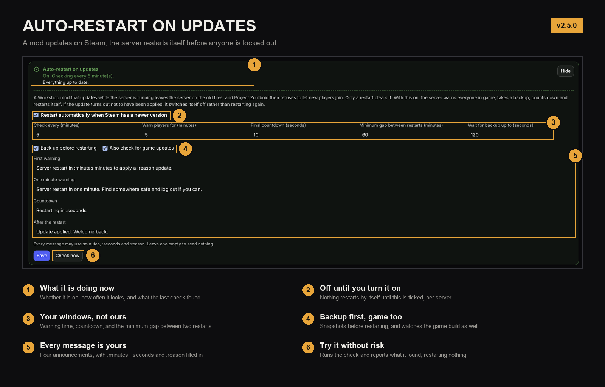

# Project Zomboid Mod Manager

A [Pelican Panel](https://pelican.dev) plugin that turns the two cryptic lines in
a Project Zomboid server config (`WorkshopItems=` and `Mods=`) into a mod manager
your whole team can use.

It adds a **Mods** page to the server panel. The page is visible to anyone with
file access to the server - not just admins - and only appears for Project
Zomboid servers.


## Why

Managing Project Zomboid mods by hand is error-prone:

- `WorkshopItems=` decides what gets **downloaded**, `Mods=` decides what gets
  **loaded**, and the two silently drift apart. A mod missing from
  `WorkshopItems=` is never downloaded by connecting clients.
- The internal mod id you need for `Mods=` only exists inside `mod.info` *after*
  the mod has been downloaded.
- Build 42 mods ship several versions in one folder (`common/`, `42.14/`), and
  one Workshop item can contain several separate mods.
- A mod with an unmet dependency is silently skipped by the server.

This plugin handles all of that and shows you what the server is *actually*
doing.

## Features

**Adding mods**
- Paste a Workshop ID, an item URL, or a **whole collection URL** - collections
  expand to every item they contain.
- Optional *auto-enable*: the plugin reads the mod id advertised on Steam so a
  single restart is often enough. The guess is verified against the real
  `mod.info` after download and corrected automatically if it was wrong.

**Honest status**
The plugin reads the server log to see which mods the running server actually
loaded, so every mod reports the truth:

| Status | Meaning |
| --- | --- |
| running | enabled and loaded by the server |
| restart to apply | enabled, on disk, not loaded yet |
| downloads on restart | enabled, not downloaded yet |
| server could not load it | the server tried and refused - usually a missing dependency |
| not found | listed in `Mods=` but nowhere on the server |

**Load order**
- Drag a mod to a new position, or use the arrows for single steps and keyboard
  use. The order in the list is the load order.
- **Auto-sort** performs a topological sort on the `require=` dependencies in
  each `mod.info`, with frameworks first.
- **Lock a mod to its position** and auto-sort works around it. Sorting can only
  see `require=` and `category=framework`, and not every framework declares
  either, so some mods have to be held in place by hand. A lock pins against
  auto-sort, not against your own edits: drag a locked mod and its lock moves
  with it.
- Known framework ids are hoisted to the front of `Mods=` on every write. The
  server skips a mod whose dependency has not loaded yet without reporting it,
  and a list rebuilt from a directory scan could otherwise leave a framework
  sitting behind the mods that need it.
- Warns when the load order has changed but has not been applied yet.

**Working in bulk**
- Tick mods in either list and enable, disable or delete the whole selection in
  one action.
- *Select all shown* follows the search box, so it never reaches past what you
  are looking at.
- A bulk delete is one config write and one delete call, not one per mod, and
  mods sharing a Workshop item are taken out together because their files leave
  together.

**Keeping the config correct**
- Workshop IDs missing from `WorkshopItems=` are restored automatically.
- Duplicate entries are removed.
- Disabling a mod also removes its Workshop ID, so clients stop downloading it,
  while the files stay on the server for a quick re-enable.
- Deleting a mod removes it from the config, deletes its files, *and* takes the
  item out of SteamCMD's own installed list. Miss that last one and the mod
  downloads itself again on the next boot.

**Knowing what happened**
- A status card that shows its working: how many Workshop items were compared,
  against which game build, when, and what the last restart was for.
- **Check now** ignores every cache and asks Steam again, item by item. When it
  cannot reach Steam it says so instead of reporting everything as fine.
- A **restart history** of the last twenty restarts the plugin performed: the
  time, the reason, which mod went from which version to which, whether the
  update was confirmed afterwards, how long the server was down, and who was
  online.

**Problem detection** - each with a one-click fix where one exists:
missing dependencies, mods that failed to load, build mismatches, mods that
threw errors during the last boot, map mods absent from `Map=`, fatal
world-loading crashes, pending downloads, and deleted mods that SteamCMD is
still holding on to.

**Nice to have**
- Titles, categories and thumbnails from Steam.
- Installed version, install date, and an *update available* badge when Steam has
  a newer build than the files on disk.
- Auto-restart when Steam has a newer version of a mod or of the game itself,
  with in-game warnings, a backup and a verification pass. Off by default.
- The Restart button on the page takes a backup too, the same one the automatic
  path takes.
- Workshop changelog viewer.
- Restart the server from the page (respects the `control.restart` permission).
- English and Dutch, through standard Laravel language files.

## Auto-restart when Steam has a newer version

A Workshop mod that updates while the server is running leaves the server on the
old files while every client holds the new ones. Project Zomboid refuses the
mismatch, so nobody new can join. Players already on notice nothing, which is
what makes it nasty: the server looks healthy while turning away everyone who
tries to connect. Only a restart clears it, and the same is true of a game
update.

Switch it on under **Auto-restart on updates** on the Mods page. It is off by
default, per server.



What happens when something is outdated:

1. Everyone in game is warned, five minutes ahead by default.
2. The world is saved and a backup of that server starts, so the snapshot holds
   a saved game rather than whatever was in memory.
3. A second warning goes out a minute before.
4. A ten second countdown, then the server restarts through the normal power
   action, so the egg's own `quit` saves and shuts down cleanly.
5. Once it is back, the plugin checks whether the update actually landed.

Warning text, all timings and the countdown are settings. So is the minimum gap
between restarts, which stops a modder publishing five updates in a row from
costing five restarts. An empty message means "say nothing".

If nobody is online the warnings and countdown are skipped, because there is
nobody to warn.

The backup is an ordinary backup of that one game server: the same thing you get
from **Backups** on the server, made by the same service the panel's own button
calls, appearing in the same list and counting against the same limit. It is not
a backup of the panel or of anything else on the node.

If the server is at its backup limit, the panel's own rotation applies and the
oldest **unlocked** backup is removed to make room. A backup you locked is never
touched, so pin anything you want to keep.

### Every setting

Warning time, check interval, backups and what to watch are picked from named
choices in the panel. The rest sits behind **Advanced**, along with the four
player messages. A value set by hand that is not one of the offered choices is
added to its list rather than rounded to the nearest one that is.

| Setting | Default | Range | What it does |
| --- | --- | --- | --- |
| Restart automatically | off | on/off | The master switch. Nothing happens until this is on. |
| Check every | 5 min | 1 to 240 | How often Steam is asked. |
| Warn players for | 5 min | 0 to 60 | How long between the first warning and the restart. `0` restarts at once. |
| Final countdown | 10 s | 0 to 60 | Messages once a second just before the restart. |
| Minimum gap between restarts | 60 min | 0 to 1440 | No second automatic restart inside this window, whatever is found. |
| Wait for backup up to | 120 s | 0 to 900 | How long a restart may wait for its backup before going ahead anyway. |
| Back up before restarting | on | on/off | Saves the world, then backs up the server. Applies to automatic restarts and to the Restart button on the Mods page. |
| What to watch | mods and game | | Whether the installed game build is compared as well as the mods. |
| First warning | text | | Sent when the window opens. |
| One minute warning | text | | Sent a minute before. |
| Countdown | text | | Sent once a second during the countdown. |
| After the restart | text | | Sent once the server is back and the update is confirmed. |

Every message may use `:minutes`, `:seconds` and `:reason`, whichever message it
is. `:reason` is `mod`, `game`, or `mod and game`. An empty message sends
nothing, which is a supported way to silence any one of the four.

Settings are per server and live in `.pz-mod-manager.json` beside the server
files, not in the panel config: two servers on one panel can use different
windows, and `artisan optimize:clear` cannot silently re-enable a feature that
restarts machines. Values are clamped to the ranges above on both read and write,
so a hand-edited file cannot schedule a restart eleven weeks out.

**Check now** runs the whole detection pass and reports what it found without
touching the server, which is the safe way to see whether it is working.

### AUTO_UPDATE is not optional

The steamcmd images only re-run steamcmd on boot when the egg variable
`AUTO_UPDATE` is `1`. Without it a restart downloads nothing, the update is still
outstanding afterwards, and the next check restarts again. That is a reboot loop
on a live server, so the plugin refuses to switch auto-restart on until the
variable is set, and offers to set it for you. It takes effect at the next start.

### It stops rather than trying twice

After the restart the plugin waits for the server to come back and re-runs the
check. If the update still has not been applied it disables itself and shows
why, rather than restarting again. A server that needs a human beats a server in
a loop.

Every lookup that fails is treated as "no information", never as "no update":
Steam unreachable, log unreadable, player count unknown. Nothing restarts on a
failed lookup. If the player count cannot be established the full warning
sequence runs anyway, since announcing to an empty server costs nothing and
restarting without warning costs somebody their progress.

### Only what the server actually loads

Auto-restart looks at the mods in `Mods=`, not at everything on disk. A mod under
**Available** can be as outdated as it likes and will never cause a restart,
because the server does not load it and it therefore cannot cause a version
mismatch for anyone.

The "update available" badge on the page is a separate thing and does show for
disabled mods, since there it is information rather than a trigger.

### Steam request volume

One check is one request, not one per mod: `GetPublishedFileDetails` takes fifty
ids per call, and the whole panel is batched into a single warm-up call before
any server is ticked, so six servers sharing mods still cost one request. The
warm-up only covers servers whose next check is actually due, so the once a
minute scheduler tick does not turn into once a minute traffic. At the five
minute default that is under 300 requests a day for a panel, against an endpoint
whose informal ceiling is in the tens of thousands.

Workshop ids Steam answers about but does not recognise, because the mod was
deleted or made private, are remembered as gone for six hours. Otherwise a
handful of dead entries in `WorkshopItems=` puts every check back on the wire no
matter how warm the cache is.

There is no API key to add. `GetPublishedFileDetails` is keyless and rate limited
by IP, so the lever is fewer calls rather than a bigger quota. If a fetch does
fail, Steam is left alone for ten minutes and cached metadata is used in the
meantime, which means an outage degrades to "no update detected" rather than to a
retry storm.

**Check now is the exception.** It clears that backoff, refetches every Workshop
item however fresh the cache is, and skips the build cache too, because the
reason anyone presses it is that they already know an update exists. It is also
the one place that reports "could not check everything" rather than "everything
up to date" when a lookup failed, since a green tick over missing information is
worse than no answer at all.

### What is compared

Every id in `WorkshopItems=`, not only the ones backing a mod in `Mods=`.
SteamCMD downloads the whole `WorkshopItems` list on boot, so checking less than
that produced the obvious complaint: the check reported nothing and the restart
downloaded something.

The two are still treated differently. An outdated item that no enabled mod
comes from cannot lock anybody out of the server, so it is reported with "no
restart needed for this one" and never triggers an automatic restart. It comes
along for free whenever the server next restarts for some other reason.

### Deleting a mod

Three things have to go, not two. The files under
`steamapps/workshop/content/<appid>/<id>`, the id in `WorkshopItems=`, and the
item's entry in `steamapps/workshop/appworkshop_<appid>.acf`. That last file is
SteamCMD's own list of what it believes is installed, and while an id sits in it
with no files on disk, the next boot downloads the mod again. It then shows up
under Available, because it is on the server but not in `Mods=`.

The manifest is Valve's file, so the edit is deliberately timid: whole balanced
blocks only, the result is checked for balance before anything is written, and
at the first surprise it writes nothing and says so. A stale entry is a
nuisance, a mangled manifest stops the server downloading anything at all.

Servers upgrading from an earlier version have usually collected a pile of these
already. The page counts them and offers a **Clean up** button.

### Restart history

The last twenty restarts the plugin performed are kept in the side-car and shown
on the page, closed by default. Each one records the time, whether it was
automatic or somebody pressing Restart, what changed and from which version to
which, whether the update was confirmed afterwards, how long the server was
down, how many players were online, and which backup was taken.

Version numbers come from `modversion` in `mod.info` when a mod declares one.
Most do not, and those show the Workshop timestamps instead. Never a mix, and
never a version invented to fill the column.

Restarts made anywhere else, from the panel's own power controls or from the
host, are invisible to the plugin and are not in the list. The panel says so
rather than letting the list look complete.

The game build check is cached per app id and shared across servers, so it costs
roughly six requests an hour to `api.steamcmd.net` no matter how many servers run
Project Zomboid.

### Detecting a game update

The installed build comes from `steamapps/appmanifest_<appid>.acf`, which
SteamCMD writes with the build id it last downloaded. The current public build
comes from `api.steamcmd.net`, because Valve does not publish an app's build id
through the Web API without authenticating as an owner. That is a third party, so
a failed lookup skips the game check and leaves the mod check running. It can be
switched off entirely.

## Requirements

- Pelican Panel (tested on `1.0.0-beta36`), with its scheduler running
  (`artisan schedule:run` every minute) if you want auto-restart
- A Project Zomboid egg (the page only appears for eggs whose name contains
  "zomboid")
- Outbound HTTPS from the panel container for Steam metadata - the plugin works
  without it, just without titles, categories and thumbnails

## Installation

**Via the panel** - download the release zip and use the Import button on the
plugin list.

**Manually** - place the plugin in your panel's `plugins` directory. The folder
name must match the plugin id:

```bash
cd /var/www/pelican/plugins        # or /opt/pelican/plugins for the Docker setup
git clone https://github.com/WildBrianNL/pz-mod-manager.git
php artisan p:plugin:install pz-mod-manager
php artisan optimize:clear
```

For the official Docker Compose setup the panel runs in a container, so run the
artisan commands inside it:

```bash
docker exec pelican-panel-1 php artisan p:plugin:install pz-mod-manager
docker exec pelican-panel-1 php artisan optimize:clear
```

### The meta block in plugin.json

Pelican keeps a plugin's enabled state in a `meta` block inside `plugin.json`,
which it writes itself. **Never ship it.** hub.pelican.dev rejects a plugin whose
published `plugin.json` contains one, and `updatePlugin()` re-runs
`installPlugin()` after downloading, so the panel puts the block back on its own.

It does matter when you deploy by copying files in by hand: that path skips the
install step, the block goes missing, and the plugin drops to `not_installed`
with the Mods page answering "route could not be found". Run
`php artisan p:plugin:install pz-mod-manager` afterwards, or keep the block.

## Updating

From 2.4.1 the panel handles this itself. `plugin.json` declares an
`update_url`, Pelican fetches it every ten minutes, compares the version there
against the installed one, and flags the row on the admin plugin list when a
newer release exists. Updating is the button next to that flag, or:

```bash
php artisan p:plugin:update pz-mod-manager
```

Two things are worth knowing before waiting for a notice that will not come.

**Update checks are disabled on canary panels.** Pelican returns early when
`config('app.version')` is `canary`, both for the check and for the download
URL, so nothing appears and nothing errors either. Tagged panel releases are
fine.

**Installs older than 2.4.1 will not announce it.** They carry
`"update_url": null`, so there is nothing for the panel to poll. Update by hand
once; every release after this one arrives on its own.

## Permissions

| Action | Required subuser permission |
| --- | --- |
| View the page | `file.read` |
| Add, enable, disable, delete, reorder, lock, bulk actions | `file.update` |
| Restart button | `control.restart` |
| Change auto-restart settings | `file.update` |
| Set `AUTO_UPDATE` from the panel | `startup.update` |

The scheduled restart itself runs as the panel, not as a user, so it is not
subject to subuser permissions. Whoever can change the settings can cause a
restart.

## How it works

The server `.ini` is the single source of truth - the plugin keeps no mod list of
its own and re-reads the config before every change, so two people editing at the
same time cannot clobber each other's work. It refuses to write whenever the
config could not be read first.

Installed mods are discovered through a single Wings search for `mod.info`, which
handles every Build 42 layout. Parsed results are cached against a fingerprint of
the files on disk, so a finished download appears immediately while repeat visits
stay fast.

## Configuration

`config/pz-mod-manager.php` holds the Steam app id, the fallback build (the
running server's build is detected automatically), the egg name to match, and
cache lifetimes. The defaults are fine for a normal Project Zomboid server.

Auto-restart is deliberately not configured here. Those settings are per server
and are edited on the page itself; see [Every setting](#every-setting).

## Building a release zip

The folder inside the zip must be named `pz-mod-manager`, and the dev tooling
stays out of it:

```bash
mkdir -p /tmp/rel/pz-mod-manager
git archive main | tar -x -C /tmp/rel/pz-mod-manager
cd /tmp/rel
rm -rf pz-mod-manager/tests pz-mod-manager/lint.sh pz-mod-manager/check.py pz-mod-manager/docs
zip -r pz-mod-manager.zip pz-mod-manager
```

Nothing that is not needed to run the plugin goes in. `docs/` is README artwork
and the script that draws it, and the three dev tools below are for this
repository, not for anyone's panel.

`tests/stubs.php` in particular declares classes named `App\Models\Server` and
`Illuminate\Support\Facades\Log` so the phase tests can run without a panel.
They are never autoloaded, since only `src/` is mapped to the namespace, but
shipping them inside a live panel is not worth the argument.

`update.json` on `main` is what every installed copy polls, so it has to name a
release that already exists. Publish the release and its `pz-mod-manager.zip`
asset first, then update the manifest. The other order points every install at a
download that 404s, and the update button fails for everyone until it is fixed.

## Development

`lint.sh` runs everything that needs a PHP: syntax on every file, the Blade
template compiled and then linted, and the unit tests. It borrows the interpreter
from a panel container over SSH, because the machine this was written on has no
PHP:

```bash
PZMM_HOST=user@panel-host ./lint.sh
```

`check.py` catches what `php -l` cannot: a translation key used but never
defined, a `wire:click` pointing at a method that does not exist, a `wire:model`
bound to a property that is not there, and a settings field missing from
`StateStore::AUTO_DEFAULTS`. None of those fail loudly at runtime; they render a
raw key, or do nothing when clicked.

## Contributing

Issues and pull requests are welcome. Please keep changes focused.

## Credits

Built by [WildBrianNL](https://github.com/WildBrianNL) for a public Project
Zomboid server, with substantial help from Claude (Anthropic). Not affiliated
with The Indie Stone or Valve.

## License

MIT - see [LICENSE](LICENSE).
